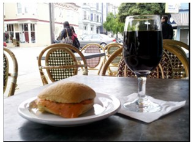
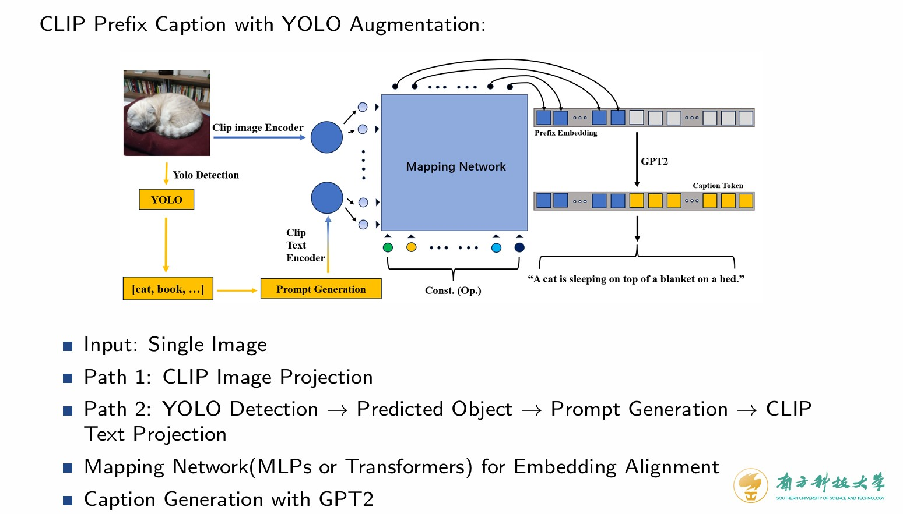
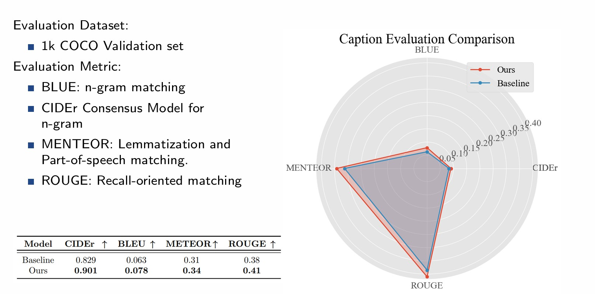
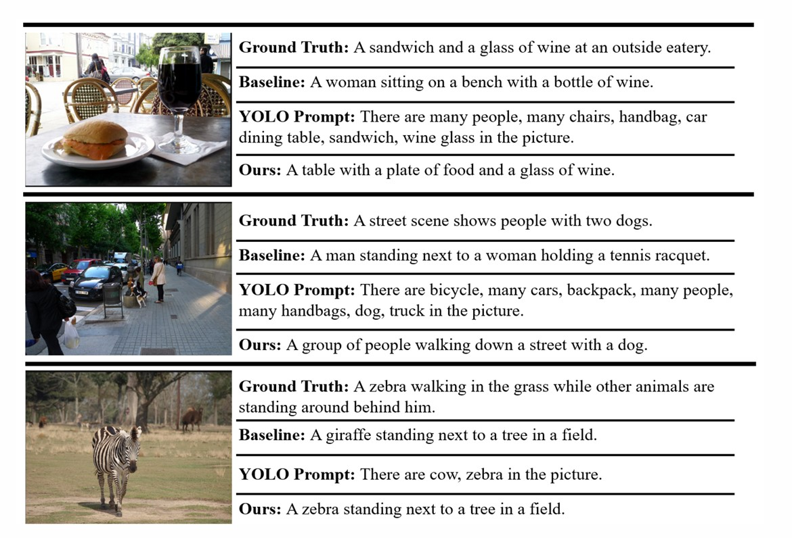

# Augmented CLIP Prefix Caption with YOLO Detection: An Attempt
An attempt to improve the performance of the ClipCap model in the [paper](https://arxiv.org/abs/2111.09734#).

## Why

Considering the highly correct recognition ability of the YOLO model, we tried to combine this ability into the ClipCap model to overcome the model's wrong caption. For example,

ClipCap: A woman sitting on a bench with a bottle of wine.

## How

1. We use yolov5 to recognize all pictures and create prompts like"There are two zebras ... in this picture".
2. Then, we use the text encoder of the CLIP to encode the prompts and acquire the embedding $Y_i$​
3. During the training process, we concat the $Y_i$ with the origin embedding of the picture and use the same train process in the paper.

Our Model's Structure

## Experiments & Evaluation

We utilized the COCO Caption dataset, featuring 10k images in this experiment, and the experimental setup involved training on a baseline model and our proprietary framework. The training spanned over 20 epochs with MLP mapping network.

For the evaluation:

## Conclusion

- In this project, we propose a novel framework that enhances the Image Captioning performance of CLIP Prefix Caption with YOLO augmentation. 
- We verify our hypothesis on a relatively small dataset, performing better than the vanilla baseline.

## Some Examples

